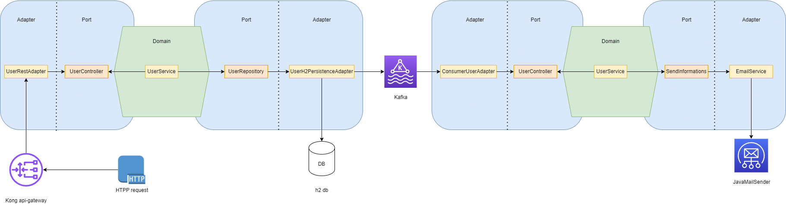

# User system

System developed in Spring Boot with a hexagonal architecture for user management.

## Features

- Registration
- Edition
- Deletion
- Listing
- Email Sending
- Dashboard for metric visualization
- Log query

## Tech

- [Spring Boot](https://spring.io/projects/spring-boot)
- [kafka](https://kafka.apache.org/)
- [Spring Boot Admin](https://docs.spring-boot-admin.com/)
- [H2 Database](https://www.h2database.com/)
- [Lombok](https://projectlombok.org/)
- [ModelMapper](https://modelmapper.org/)
- [Docker](https://www.docker.com/)
- [ZooKeeper](https://zookeeper.apache.org/)
- [Kafdrop](https://github.com/obsidiandynamics/kafdrop)
- [Angular](https://angular.io/)
- [Angular Material](https://material.angular.io/)

## Diagram


## Tests


## Installation

If you prefer to run them separately, you can follow this tutorial, but I recommend using the [Docker](#docker) part.

#### Zookeeper and kafka (Mandatory for spring applications)
```sh
docker network create kafka-net

docker run -d --name zookeeper --restart no --network kafka-net -p 2181:2181 zookeeper:3.7.0

docker run -d --name kafka --restart no -p 9092:9092 -e KAFKA_LISTENER_SECURITY_PROTOCOL_MAP=DOCKER_INTERNAL:PLAINTEXT,DOCKER_EXTERNAL:PLAINTEXT -e KAFKA_LISTENERS=DOCKER_INTERNAL://:29092,DOCKER_EXTERNAL://:9092 -e KAFKA_ADVERTISED_LISTENERS=DOCKER_INTERNAL://kafka:29092,DOCKER_EXTERNAL://${DOCKER_HOST_IP:-127.0.0.1}:9092 -e KAFKA_INTER_BROKER_LISTENER_NAME=DOCKER_INTERNAL -e KAFKA_ZOOKEEPER_CONNECT=zookeeper:2181 -e KAFKA_BROKER_ID=1 -e KAFKA_OFFSETS_TOPIC_REPLICATION_FACTOR=1 obsidiandynamics/kafka
```

#### Spring backend
```sh
cd backend

./mvnw spring-boot:run
```

#### Spring consumer
```sh
cd consumer

./mvnw spring-boot:run
```

#### Angular UI
```sh
cd ui

npm i

npm start
```

For production environments...

```sh
npm install --production
NODE_ENV=production node app
```
## Docker

The magic of Docker:

```sh
docker compose up
```

## Accessing the services

In this list, you will have all the available services

- Angular UI <http://localhost:4200/>
- Spring boot admin <http://host.docker.internal:8080/>
- Kafka message list <http://localhost:9000/>

## License

MIT

